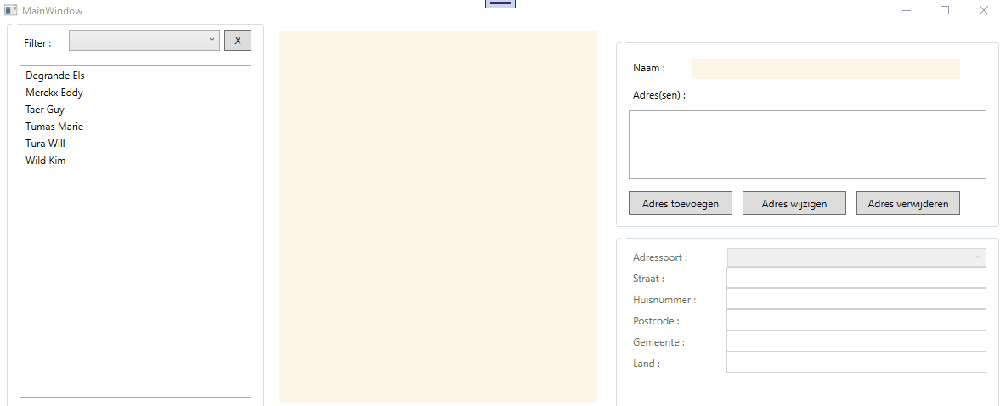

# Monitoraat 02/06/2021

De bedoeling van deze monitoraatsessie is om nog eens een volledig voorbeeld uit te werken rond de belangrijkste zaken die we behandeld hebben in onze cursussen PRB en PRA : 
  * Entiteitsklassen  (& objecten)
  * Serviceklassen  (& collections)
  * Overerving 
  * Interfaces
  * Compositie  
  
Naast deze belangrijke concepten halen we - waar mogelijk - ook nog een aantal bijkomende zaken/technieken aan (denk aan nullables, short hand if, string extrapolatie ...)

Het is niet de bedoeling van deze monitoraatsessie dat jullie zelf tijdens de sessie gaan programmeren : jullie volgen gewoon op het scherm mee hoe ik stap voor stap tot een oplossing ga komen.  
Uiteraard kan je achteraf alles zelf nog eens uitproberen door deze repo binnen te halen.
De volledige oplossing van dit projectje kan je dan weer hier terugvinden : https://github.com/howest-gp-pra/cu-monitoraat2 

Wanneer je de starterscode binnenhaalt zal je merken dat er heel wat in zit.

### De class library 

In de class library zijn 4 mappen aanwezig : 
  * Enums  
    In deze map zit 1 bestand met de naam Enums.cs.  
    In het bestand zelf zal je 3 publieke enumeraties terugvinden :   
      * AddressType : 4 verschillende soorten adrestypes  
      * Function : 4 verschillende soorten functies  
      * Diploma : 8 verschillende soorten diploma's  
    Deze enumeraties zullen op verschillende plaatsen in je programma gebruikt worden.
  * Interfaces  
    In deze map zitten 4 bestanden : 
      * IPerson.cs : deze interface beschrijft 8 eigenschappen en 1 methode.  Deze zal straks geïmplementeerd worden door de entiteitsklasse Person (zie verder)   
      * IStaff.cs : deze interface beschrijft 2 eigenschappen en zal straks geïmplementeerd worden door de entiteitsklasse Staff (zie verder)  
      * IStudent.cs : deze interface beschrijft 1 eigenschap en zal straks geïmplementeerd worden door de entiteitsklasse Student (zie verder)
      * IPersonService : deze interface beschrijft 1 (read only) eigenschap en 2 methoden en zal straks geïmplementeerd worden door de service klasse PersonService (zie verder)
  * Entities   
    In deze map zitten 4 bestanden (entiteitsklassen) (die nog volledig dienen ingevuld te worden) :   
    * **Address**   
      Deze klasse beschrijft een adres en dient volgende members te krijgen :   
        * Eigenschappen (eenvoudige props, geen controle vereist) :   
          * prop Street (string)  
          * prop HouseNumber (string)  
          * prop PostalCode (string)  
          * City (string)  
          * AddressType (enumeratietype AddressType)
        * 1 constructor die evenveel waarden als props ontvangt  
        * Overschrijft de ToString en toont  adrestype : straat, huisnummer - postocde gemeente - land
    * **Person**  
      Dit is een basisklasse waarvan geen instanties van mogen gemaakt worden.  
      De klasse implementeert de IPerson interface.  Je maakt de props aan zoals de Interface opgeeft.  
      Bijkomende info : 
        * Indien geen naam meegegeven wordt dient een fout opgegooid te worden.  
        * Indien de geboortedatum kleiner is dan 1/1/1920 wordt deze automatisch aangepast naar 1/1/1920.  Is de opgegeven waarde groter dan vandaag, dan wordt deze automatisch aangepast naar vandaag.    
        * De eigenschap AgenInYears (leeftijd uitgedrukt in jaren) is readonly en is het resultaat van een berekening op basis van de geboortedatum.  
        * Een persoon kan meerdere e-mail adressen hebben : deze worden bijgehouden als een List van strings (= compositie).  Deze List mag enkel binnen deze klasse geïnstantieeerd kunnen worden.  
        * Een persoon kan meerdere adressen hebben : deze worden bijgehouden als een List van Address objecten (= compositie).  Deze List mag enkel binnen deze klasse geïnstantieeerd kunnen worden.  
    
      De klasse heeft 2 constructors :  
        * versie 1 ontvangt volgende waarden : naam, geboortedatum, telefoon, geslacht (optioneel)  
        * versie 2 ontvangt volgende waarden : naam, geboortedatum, telefoon, moedertaal, geslacht (optioneel)  
      Maak gebruik van constructor chaining !    
    
      De klasse overschrijft de ToString en geeft in de plaats gewoon de naam van de persoon.  
    
      De klasse moet (volgens de Interface) ook voorzien in een methode **ShowDetails** die een string retourneert.   
      Deze methode bouwt a.d.h.v. de eigenschappen volgende tekst op : 
    
      > Ella Fitzgerald   
      > Geboortedatum : 1/1/2000  
      > Leeftijd : 21 jaar  
      > Geslacht : vrouw  
      > Moedertaal : nederlands  
      > Telefoon : 0497123456  
      > Email #1 : ella@fitzgerald.be  
      > Email #2 : ella@hotmail.com  
      > Adres #1 : (resultaat van Address ToString)  
      > Adres #2 : (resultaat van Address ToString)  
      
      Deze methode moet kunnen overschreven worden door afgeleide klassen.    
    
    * **Staff**  
      Deze klasse erft over van **Person** en implementeert de **IStaff interface**   
      Implementeer de bijkomende props van de Interface (er zijn geen bijkomende voorwaarden).  
      Zorg dat er constructors zijn om de constructors uit de basisklasse van de nodige waarden te voorzien.  
      De klasse overschrijft de **ShowDetails** methode van de basisklassen maakt er het volgende van :   
    
      > STAFF  
      > (het resultaat van de ShowDetails() methode van de basisklasse)  
      > Functie : kader  
      > Diploma : Niveau4  
      
    * **Student**  
      Deze klasse erft over van **Person** en implementeert de **IStudent interface**  
      Implementeer de bijkomende prop van de Interface (er zijn geen bijkomende voorwaarden).  
      Zorg dat er constructors zijn om de constructors uit de basisklasse van de nodige waarden te voorzien.  
      De klasse overschrijft de **ShowDetails** methode van de basisklassen maakt er het volgende van :   
    
      > STUDENT  
      > (het resultaat van de ShowDetails() methode van de basisklasse)  
      > Diploma : Niveau5   
   
  * Services   
    Er bevindt zich 1 (service) klasse in deze map : **PersonService**   
    Deze klasse implementeert de IPersonService interface  
    Implementeer de prop en de methoden die de interface oplegt.   
    In de (argumentloze) constructor zorg je voor seeding.   
    De verplichte methode GetPersonTypes retourneert een collectie van Type objecten (insanties van de .Net klasse Type).  Je maakt deze collectie aan door je collectie van Persons te doorlopen en elke type (in ons geval dus Staff en Student) toe te voegen aan deze collectie die je dan tenslotte retourneert.   
    De verplichte methode GetPersonsPerType zal dan uiteraard enkel de personen uit onze collectie Persons halen die van hetzelfde type zijn als het argument dat wordt aangeleverd.  
    
### Code behind

Voor de code behind verwijs ik naar de demo hieronder :   

